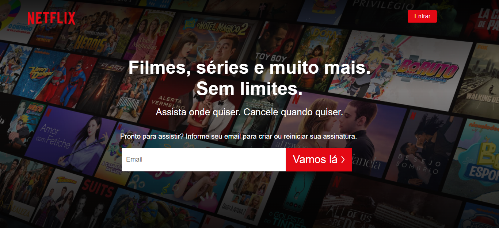
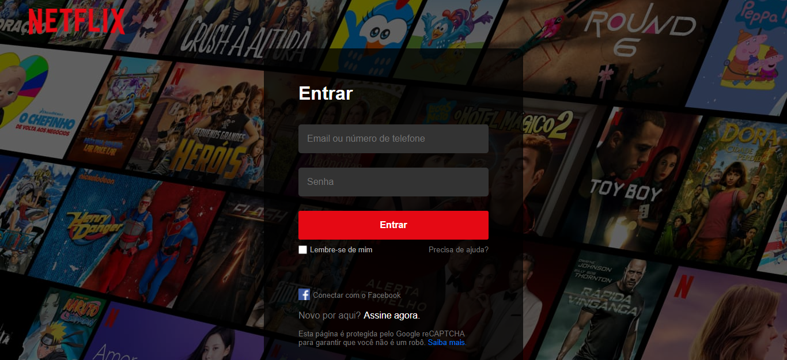
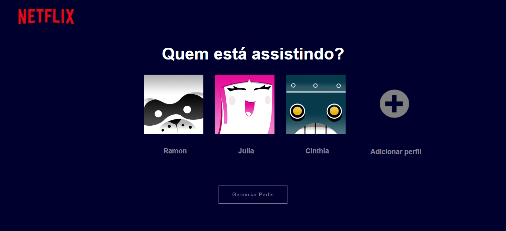
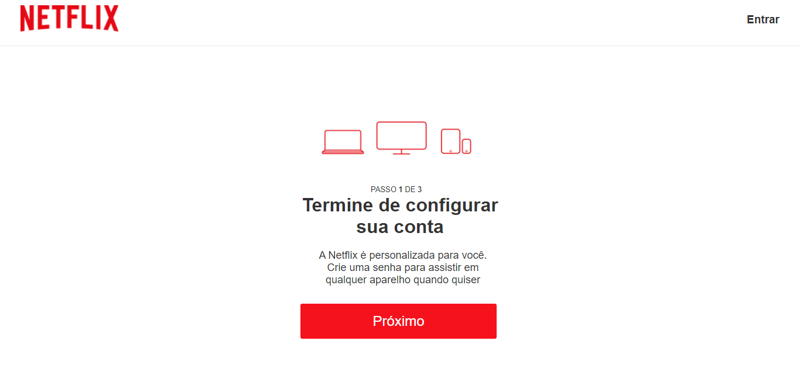
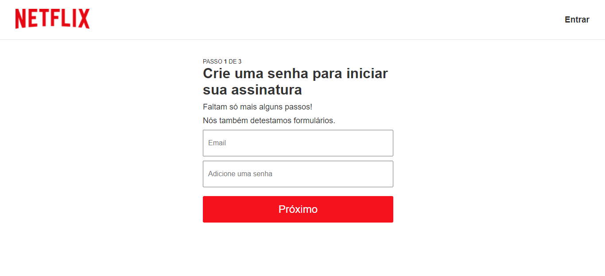
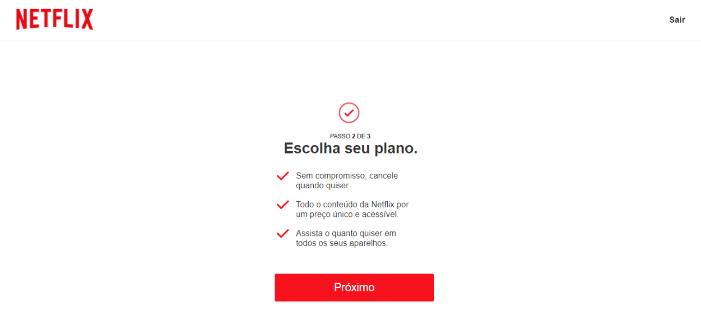
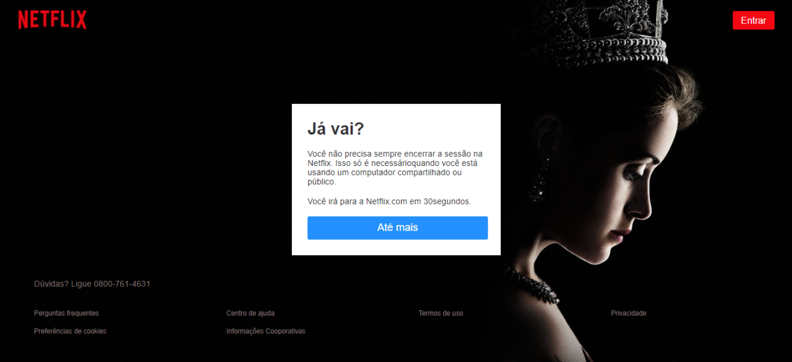

<h1 align="center">Clone Netflix💻✨</h1>

<h3>Projeto Finalizado 🚀✔</h3>
 

O projeto consiste em um clone da Netflix, para o desenvolvimento das habilidades em HTML e CSS. No momento totalmente voltado a versão Desktop. Com adição de Javascript apenas para uma área especifica. 

<h2> 💻 Versão Desktop </h2>
 
 
 
 
 
 
 
 

<h2> 🛠⚙️Tecnologias </h2>

Para o desenvolvimento deste projeto usei as seguintes tecnologias:

<ul>
    <li>HTML5;</li>
    <li>CSS3;</li>
    <li>Javascript;</li>
    <li>VS Code;</li>
    <li>Git.</li>
</ul>
 

<h2>⚖️📋 Licença</h2>

Esse projeto está sob licença MIT. Veja o arquivo <a href="https://github.com/thaay93/login_page/blob/main/LICENSE">LICENÇA</a> para mais detalhes.
 

<h2>Autor</h2>

Codificado com ❤️ por Taynara Martins 🐷🛸. Entre em contato! 👋

